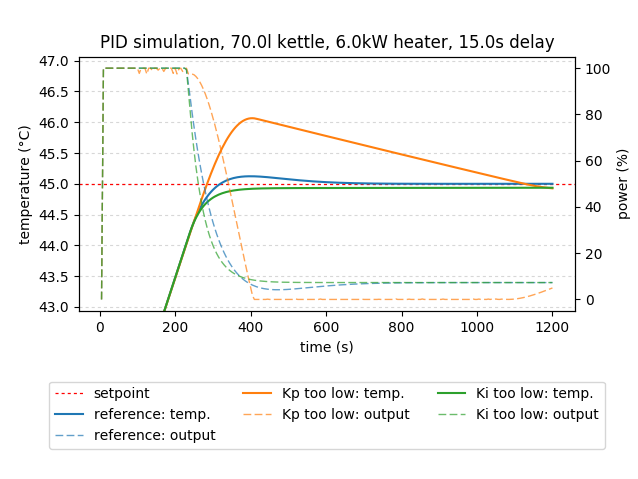
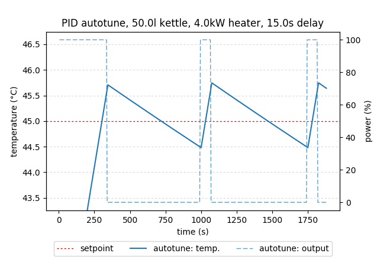

# PID-controller/brewing kettle simulation

This project has been created to support tuning a PID controller for a home brewing setup using [CraftBeerPI](https://github.com/Manuel83/craftbeerpi).
It consists of a brewing kettle simulation, a PID controller (based on [Arduino PID Library](http://brettbeauregard.com/blog/2011/04/improving-the-beginners-pid-introduction/)) and a PID autotune algorithm (based on [Arduino PID Autotune Library](http://brettbeauregard.com/blog/2012/01/arduino-pid-autotune-library/))

### Project goals

- allow users to find PID parameters which provide a sufficient basis for further manual tuning
- allow users to compare different PID parameters
- help users to understand how different PID parameters (Kp, Ki, Kd) influence a PID controller's behavior (not only limited to home brewing setups)
- speed up auto tuning

## PID comparison

Compare different PID parameters using the default kettle setup:  
`sim.py --pid 'reference' 98 0.66 230 --pid 'Kp too low' 30 0.66 230 --pid 'Ki too low' 98 0.01 230`



## PID autotune simulation

Simulate a PID autotune run on a 50l kettle with a 4 kW heater:  
`sim.py --atune --volume 50 --power 4`



Generated PID parameters using different tuning rules:

```
rule: ziegler-nichols
Kp: 7.66141138481997
Ki: 0.4086086071903984
Kd: 35.91286586634361

rule: tyreus-luyben
Kp: 5.920181524633613
Ki: 0.07104217829560336
Kd: 35.239175741866745

rule: ciancone-marlin
Kp: 3.9467876830890756
Ki: 0.46308975481578485
Kd: 18.272165199486462

rule: pessen-integral
Kp: 9.30314239585282
Ki: 0.6202094930568547
Kd: 52.46132929992192

rule: some-overshoot
Kp: 4.341466451397983
Ki: 0.2315448774078924
Kd: 54.26833064247478

rule: no-overshoot
Kp: 2.60487987083879
Ki: 0.13892692644473545
Kd: 32.56099838548487

rule: brewing
Kp: 104.1951948335516
Ki: 0.8335615586684127
Kd: 205.64841085569392
```

## Options

```
usage: sim.py [-h] [-p name kp ki kd] [-a] [-v] [-e] [-n] [-t T] [-s T]
              [--ambient T] [-i t] [-d t] [--sampletime t] [--volume V]
              [--diameter d] [--power P] [--heatloss x] [--minout x]
              [--maxout x]

optional arguments:
  -h, --help            show this help message and exit
  -p name kp ki kd, --pid name kp ki kd
                        simulate a PID controller
  -a, --atune           simulate autotune
  -v, --verbose         be verbose
  -e, --export          export data to a .csv file
  -n, --noplot          do not plot the results
  -t T, --temp T        initial kettle temperature in °C (default: 40)
  -s T, --setpoint T    target temperature in °C (default: 45)
  --ambient T           ambient temperature in °C (default: 20)
  -i t, --interval t    simulated interval in minutes (default: 20)
  -d t, --delay t       system response delay in seconds (default: 15)
  --sampletime t        temperature sample time in seconds (default: 5)
  --volume V            kettle content volume in liters (default: 70)
  --diameter d          kettle diameter in cm (default: 50)
  --power P             heater power in kW (default: 6)
  --heatloss x          kettle heat loss factor (default: 1)
  --minout x            minimum PID controller output (default: 0)
  --maxout x            maximum PID controller output (default: 100)
```

# Installation
1. Install _git_ and _python3_
2. Clone this repository:  
`git clone https://github.com/hirschmann/pid-autotune.git`
3. Install project dependencies:  
`pip install matplotlib`

After you have completed these steps, you should be able to run _sim.py_ as shown above. If plots are not shown, you have to configure the matplotlib backend, see [What is a backend?](http://matplotlib.org/faq/usage_faq.html#what-is-a-backend)
